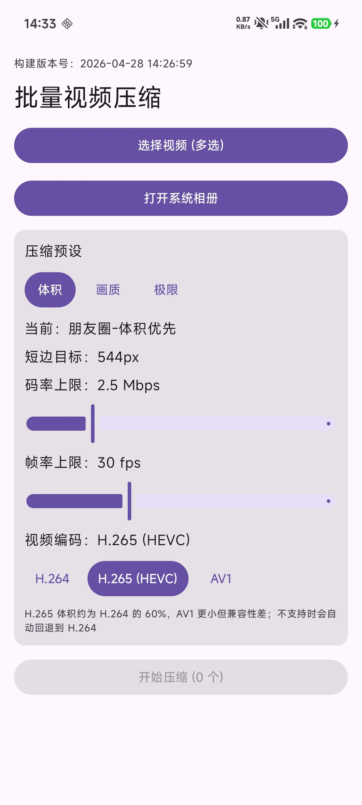

# VideoCompress

VideoCompress is a lightweight Android application designed to compress videos efficiently using the **Media3 Transformer** API.

## Screenshots



## Features

- **Efficient Compression**: Leverages Android Media3 Transformer for high-performance video transcoding.
- **Material 3 UI**: Modern and clean user interface built with Jetpack Compose.
- **Gallery Integration**: Easily select videos from your device using a native picker or MediaStore integration.
- **Batch Processing**: (Check if supported, based on code) Optimized for smooth video handling.
- **Build Information**: Displays build time and version information within the app for tracking.

## Technical Stack

- **Language**: [Kotlin](https://kotlinlang.org/)
- **UI Framework**: [Jetpack Compose](https://developer.android.com/jetcompose)
- **Video Engine**: [Media3 Transformer](https://developer.android.com/guide/topics/media/transformer)
- **Asynchronous Programming**: [Kotlin Coroutines](https://kotlinlang.org/docs/coroutines-overview.html)
- **Architecture**: MVVM (ViewModel, LiveData/StateFlow)

## Requirements

- **Minimum SDK**: Android 7.0 (API 24)
- **Target SDK**: Android 15 (API 36)
- **Java Version**: 17

## How to Build

### Using Android Studio
1. Clone the repository.
2. Open the project in Android Studio (Ladybug or newer recommended).
3. Wait for Gradle sync to complete.
4. Run the `app` module on an emulator or physical device.

### Using Command Line (Windows)
To build a release APK, you can use the provided script:
```batch
build_release.bat
```
This will generate a renamed APK at `app/build/outputs/apk/release/VideoCompress.apk`.

## Project Structure
- `app/src/main/java/com/cloudwinbuddy/videocompress/compress`: Core compression logic using Media3.
- `app/src/main/java/com/cloudwinbuddy/videocompress/viewmodel`: UI logic and state management.
- `app/src/main/java/com/cloudwinbuddy/videocompress/ui`: Compose screens and components.
- `app/src/main/java/com/cloudwinbuddy/videocompress/util`: Utility classes for MediaStore and file handling.

## License

This project is licensed under the MIT License - see the [LICENSE](LICENSE) file for details. (Note: You may want to add a LICENSE file if you plan to share this publicly).
